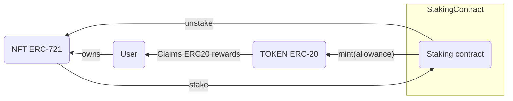

# Analysis

## Context

Consider an NFT collection that belongs to an L1 blockchain.

Create a smart contract that lets holders of NFTs (<https://docs.openzeppelin.com/contracts/5.x/erc721>), stake their NFTs and earn rewards on those staked NFTs every 24h (when staked).
The owners should then claim those ERC20 whenever they want (they pay the gas fee).

Rules:

- The rewards earned must be calculated (instead of having a constant curve time for generating ERC20 rewards) using a [monotonic](https://en.wikipedia.org/wiki/Monotonic_function) [piecewise](https://en.wikipedia.org/wiki/Piecewise_function) function.
- This curve should be pass it as parameter in the constructor in the form of an array.
- The locking period should be 7 days.

The piecewise function should be:

$$
    f(x) = \begin{cases}
        7, & 0 < x < 7 \\
        x, & 7 < x < 14 \\
        14, & 14 < x < 21 \\
        x-7, & 21 < x < 28
    \end{cases}
$$

Where `x` is measured in days.

- You can use this [playground](https://trkern.github.io/p.html?7_0_7_4__x_7_14_4__14_14_21_6__x-7_21_28_6) to plot it and see its behavior.

## Scenarios and User Stories documentation

- [nft staking](stories/0001-nft-staking.md)
- [nft unstaking](stories/0002-nft-unstaking.md)

> [!IMPORTANT]
> Please read [prototyping](./prototyping.md) for showing your presentation.
