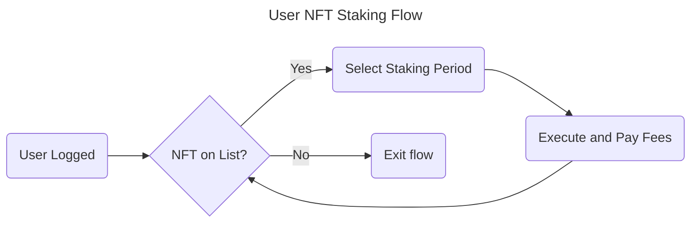

# 1. User NFT Staking Flow



```gherkin
Feature: User NFT Staking

Scenario: User successfully stakes an NFT

Given a user is logged in
When the user has an NFT on the list
And the user selects a staking period
And the user executes the staking and pays the fees
Then the user should be returned to the NFT list
```

```gherkin
Feature: User NFT Staking

Scenario: User has no NFTs to stake

Given a user is logged in
When the user has no NFTs on the list
Then the user should be exited from the flow
```

```gherkin
Feature: User NFT Staking

Scenario: User fails to execute staking

Given a user is logged in
When the user has an NFT on the list
And the user selects a staking period
When the user fails to execute the staking
Then the user should be returned to the NFT list
```

```gherkin
Feature: User NFT Staking

Scenario: User fails to pay fees

Given a user is logged in
When the user has an NFT on the list
And the user selects a staking period
When the user fails to pay the fees
Then the user should be returned to the NFT list
```
