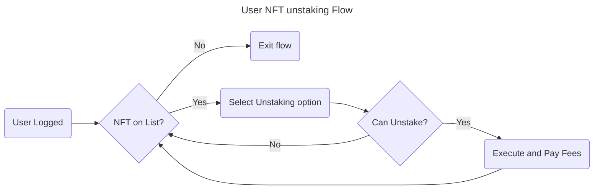

# 2. User NFT Unstaking Flow



```gherkin
Feature: NFT Unstaking

Scenario: Successful NFT Unstaking
    Given the user is logged in
    When the user has an NFT on the list
    And the user selects the unstaking option
    And the user can unstake the NFT
    Then the user executes the unstaking process and pays the fees
```

```gherkin
Scenario: Unsuccessful NFT Unstaking (User Cannot Unstake)
    Given the user is logged in
    When the user has an NFT on the list
    And the user selects the unstaking option
    And the user cannot unstake the NFT
    Then the user remains on the unstaking page with an appropriate message
```

```gherkin
Scenario: Unsuccessful NFT Unstaking (NFT Not on List)
    Given the user is logged in
    When the user does not have an NFT on the list
    Then the user is redirected to the NFT listing page
```
